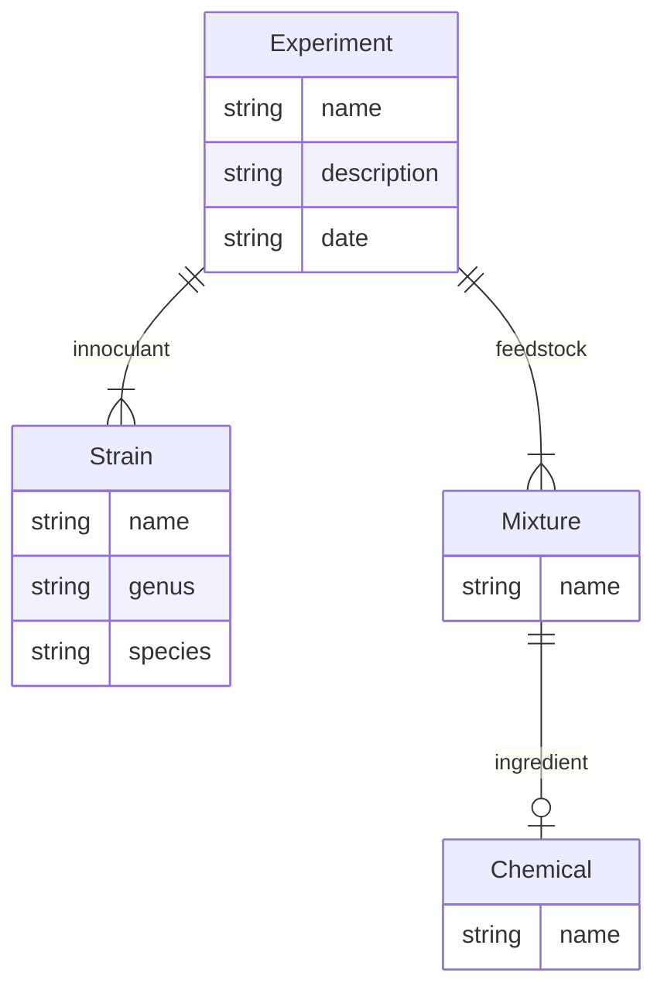

# UI/UX Assessment

This assessment is intended to be a short exercise in design and development. We want
to see a little about how you approach designing user interfaces and little bit of
development of a user interface. Neither of these have to be complete designs nor
implementations. The key outcome here is a clear communication of your approach for
both.

You should focus on:

 * a clear and concise design document with artifacts like task models, wire frames, and textual descriptions of your design
 * a simple implementation of some aspect of the design using your favorite toolkits (or ours)

Things we use:

 * We currently produce our design documents in a combination of google docs and markdown+mermaid diagrams. Google docs is great for collaboration and markdown along with mermaid and other things can live with the code. 
 * We use React, custom javascript, and things like cytoscape.js for user interface development.
 * We use UIkit (see https://getuikit.com) as an HTML widget library for building user interface components
 * All our backend services are build with Python and Flask - which includes the "backend for the frontend".

## What you need to do

Imagine you are tasked with building a user interface to 
data for experiments run in our lab. Your users don't 
know exactly what they want but the system produces
data. This data has been codified into a simple service.

Your task is to present a conceptual user interface for accessing 
the data to the users. While you will eventually need to present a 
complete solution, the task here is to simply give them a flavor for what 
the design might look like and to also build a little prototype
that shows some of the data.

You must:

1. Review the data and design a simple wireframe for navigating the data.
2. Implement a very small portion of that wireframe in your favorite UI technology.
3. Document what you have done for us to review.

For item (1), the design:

 * You should make a short document with simple line diagrams for the wireframe. It doesn't have to be polished but it should contain enough of a description to understand what the full user interface might look like.
 * If you want to embellish the user interface in the design with additional CRUD tasks like "create experiment" / "delete experiment", that's great but not required. 
 * We simply want data visualization & navigation.
 * Use the tools you are familiar with to create the wireframe and design document. If you use Word, Figma, etc., just provide a PDF file of the output.
 * For the design, keep in mind that there might be thousands of experiments, chemicals, strains, etc. even though the sample data set is small.

For item (2), the implementation:

 * We obviously have a preference for React and that would be the simplest way to proceed.
 * If you want to use something else, that is just fine.  
 * All we want to see is that you can hook up your front end to the backend with some aspect of your design.
 * The user interface doesn't have to be very pretty. 
 * **Don't spend too much time on making it look good. We aren't looking at that aspect of your implementation.**
 * You can get good results quickly with toolkits like UIkit (see https://getuikit.com)  

For item (3), documentation:

 * Help us find and navigate what you have done by being clear and concise.
 * Place all your documentation in the `uiux/docs` folder and update
the README.md with an inventory of the documentation files
 * If needed, provide us any additional technical instructions for running your implementation.

Keep in mind:

 * Keep things brief and your time spent on this task to less than 2 hours (3 hours max). 
 * We want to see how you approach the problem and how you communicate. 
 * This is less about technical execution.
 * In a real world situation, you would have a lot more time to do all the tasks.
 * We'll have a chance to discuss your work afterwards as a follow up.

## What to turn in

1. Copy all your design documents into the `uiux/docs` folder.
2. Make sure the `uiux/docs/README.md` file is updated with the list of documents and their purpose.
3. Ensure any implementation code is in the right places in the `uiux` folder.
4. Document anything necessary to run your implementation if it is somehow different in the `docs/README.md` file.
5. Zip up the entire `uiux` directory and return that (e.g., via email).


## Overview of the data

For this assessment, we'll focus on a vastly simplified data model for incubation
experiments:



There is sample data in JSON format in the [data](data) directory.

The main data entity is an experiment. A scientist will create an experiment
with a particular set of inoculants (often only one). An inoculant is
a strain of bacteria.

The experiment also involves a feedstock that is a mixture of chemical 
ingredients or a sample. When the ingredients are not known, the list 
of chemicals is empty.

The entity descriptions are:

 * Experiment - an experiment with a set of inoculants
 * Strain - a strain of bacteria
 * Mixture - a stock mixture used in an experiment that is the environment for the innoculant
 * Chemical - an ingredient in a mixture

## Project setup

### Setup python

You should use your favorite python environment. We recommend using [miniconda](https://docs.conda.io/en/latest/miniconda.html) if you do not already have a python 3.11+ environment.

Setup your environment:

```
cd uiux
conda create -n uiux python=3.11
conda activate uiux
pip install -r requirements.txt
```

### Running the service

You can run the service by just running the module:

```
python -m fe_service
```

Then open http://localhost:8890/ in your browser. 

### Where to start

Directories:

 * `data` is where all the sample data is located.
 * `fe_service` is the flask application
 * `app` is a basic react application

The flask application is setup to serve all the data at `/data` using a simple API:

 * `/data/` - the root of the service
 * `/data/experiments` - lists all the experiments
 * `/data/experiments/<name>` - returns a specific experiment
 * `/data/strains` - lists all the strains
 * `/data/strains/<name>` - returns a specific strain
 * `/data/mixtures` - lists all the mixtures
 * `/data/mixtures/<name>` - returns a specific mixture
 * `/data/chemicals` - lists all the chemicals
 * `/data/chemicals/<name>` - returns a specific chemical

You should not need to change the Flask application nor the data files. Once you have the application running, you can test the data returned via the browser or using curl.

The flask application is set up to serve the static content from `fe_service/frontend`. If you build the React application, it will output the results into that directory.

Also, there are two convenience functions setup in the [App.js](app/src/App.js) 
for fetching lists (`fetchList`) of data and specific data items (`fetchItem`) and
examples of their use.

### Building React applications

The pre-configured React application code is in `app` and can be built with:

```
cd app
npm run build
```

The output should automatically be in the correct place (i.e., `fe_service/frontend`) for the Flask application. When developing, you can simply just run the npm build and then reload the web page.

**If you are building a React application**, just start with the configuration as it has already has been provided to you.

**If you are using something else**, just place the static content and other assets in the `fe_service/frontend` directory. The current content in that directory is the result of a React build.


