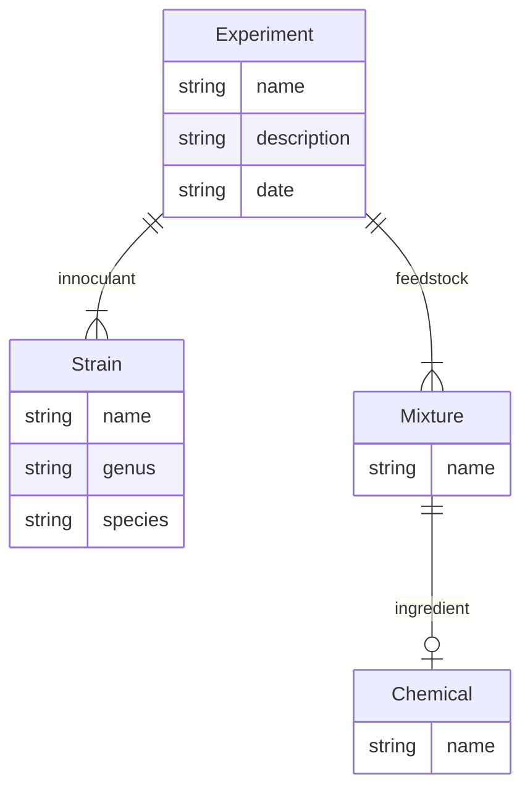

# UI/UX Assessment

This assessment is intended to be a short exercise in design and development. We want
to see a little about how you approach designing user interfaces and little bit of
development of a user interface. Neither of these have to be complete designs or
implementations. The key outcome here is a clear communication of your approach for
both.

You should focus on:

 * a clear and concise design document with artifacts like task models, wire frames, and textual descriptions of your design
 * a simple implementation of some aspect of the design using your favorite toolkits (or ours)

Things we use:

 * We currently produce our design documents in a combination of google docs and markdown+mermaid diagrams. Google docs is great for collaboration and markdown along with mermaid and other things can live with the code. 
 * We use React, custom javascript, and things like cytoscape.js for user interface development.
 * We use UIkit (see https://getuikit.com) as an HTML widget library for building user interface components
 * All our backend services are build with Python and typically Flask - which includes the "backend for the frontend".

## Overview of the data

For this assessment, we'll focus on a vastly simplified data model for incubation
experiments:

